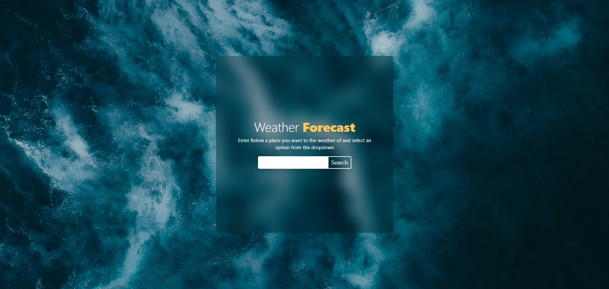
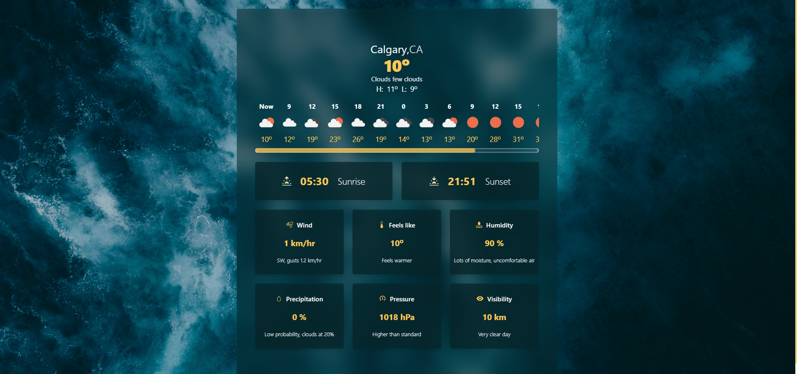

# Weather app made with Typescript, React, and Tailwind 

I wanted to practice typescript and API handling; This project encompasses both of these topics. 
This project features a search field that suggests the top 5 locations based on user input via an API. Upon submission, another API call retrieves the weather data.

Uses the Current Weather API from [OpenWeather](https://openweathermap.org/current)

Based on the Weather API Challenge by [danascript](https://theultimateapichallenge.com/challenges/weather-typescript-api)




Live Website: [Weather App](https://weather-app-tseidolon.netlify.app/)

Mockup Made in Figma: [Figma Mockup](https://www.figma.com/design/QENyRFgzuzgAXExchpsm29/Weather-App?node-id=0-1&t=Ffq3J105OrmtKjTU-1)

Attributions:
- Ivan Bandura - [blue and white clouds during daytime](https://unsplash.com/photos/blue-and-white-clouds-during-daytime-Ht8n5GGzXuM)
- Freepik - [Chameleon Icon](https://www.flaticon.com/free-icon/chameleon_7336277?term=chameleon&page=1&position=76&origin=search&related_id=7336277)

Tools Used
- React
- Typescript
- Tailwind


---

This template provides a minimal setup to get React working in Vite with HMR and some ESLint rules.

Currently, two official plugins are available:

- [@vitejs/plugin-react](https://github.com/vitejs/vite-plugin-react/blob/main/packages/plugin-react) uses [Babel](https://babeljs.io/) for Fast Refresh
- [@vitejs/plugin-react-swc](https://github.com/vitejs/vite-plugin-react/blob/main/packages/plugin-react-swc) uses [SWC](https://swc.rs/) for Fast Refresh

## Expanding the ESLint configuration

If you are developing a production application, we recommend updating the configuration to enable type-aware lint rules:

```js
export default tseslint.config({
  extends: [
    // Remove ...tseslint.configs.recommended and replace with this
    ...tseslint.configs.recommendedTypeChecked,
    // Alternatively, use this for stricter rules
    ...tseslint.configs.strictTypeChecked,
    // Optionally, add this for stylistic rules
    ...tseslint.configs.stylisticTypeChecked,
  ],
  languageOptions: {
    // other options...
    parserOptions: {
      project: ['./tsconfig.node.json', './tsconfig.app.json'],
      tsconfigRootDir: import.meta.dirname,
    },
  },
})
```

You can also install [eslint-plugin-react-x](https://github.com/Rel1cx/eslint-react/tree/main/packages/plugins/eslint-plugin-react-x) and [eslint-plugin-react-dom](https://github.com/Rel1cx/eslint-react/tree/main/packages/plugins/eslint-plugin-react-dom) for React-specific lint rules:

```js
// eslint.config.js
import reactX from 'eslint-plugin-react-x'
import reactDom from 'eslint-plugin-react-dom'

export default tseslint.config({
  plugins: {
    // Add the react-x and react-dom plugins
    'react-x': reactX,
    'react-dom': reactDom,
  },
  rules: {
    // other rules...
    // Enable its recommended typescript rules
    ...reactX.configs['recommended-typescript'].rules,
    ...reactDom.configs.recommended.rules,
  },
})
```
# weather-app-v1
